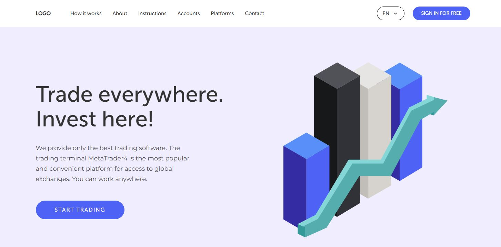
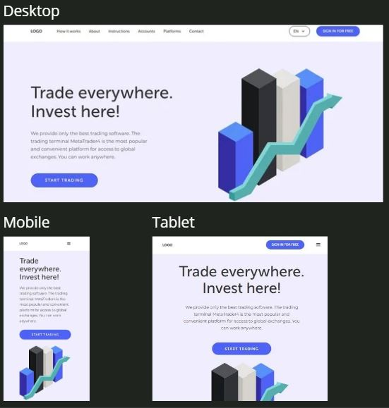
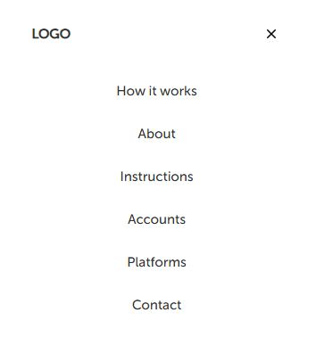
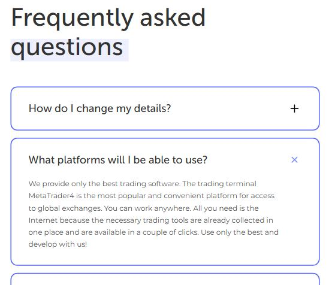
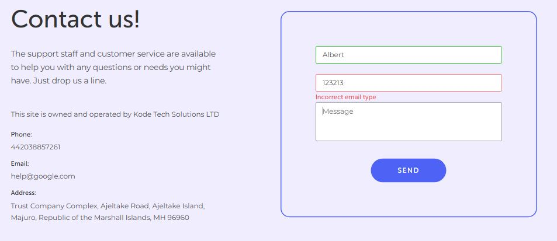

<h1 align="center">TradeInvest Landing</h1>

<h2>About Landing</h2>
<p>Landing page for tools of trading and invest.</p>


<h2>Features</h2>
<ul>
  <li>
    <h3>Adaptive layout</h3>
    <p>Thanks to the adaptive layout, the site can adapt to different screen widths of devices such as smartphones, tablets or desktops.</p>
    
  </li>
    <li>
    <h3>Mobile menu</h3>
    <p>The project includes a mobile navigation menu.</p>
    
  </li>
   <li>
    <h3>Slider</h3>
    <p>A slider was added to the "People love Big Invest" section of the site. Using scrolling gestures and buttons, it makes it easy to scroll through reviews.</p>
    
  </li>
   <li>
    <h3>Frequently asked questions</h3>
    <p>There is a section with frequently asked questions.</p>
    
  </li>
   <li>
    <h3>Form validation</h3>
    <p>The site includes form validation. This allows you to inform the user that he has not correctly entered the data in the form fields before sending.</p>
    
  </li>
</ul>

## Installation Guide

1. Clone the repository:

   ```bash
   git clone https://github.com/Yarzik7/trade-invest-landing.git
   ```

2. Navigate to the project directory:

   ```bash
   cd trade-invest-landing
   ```

3. Start the project (Example using http-server):

   ```bash
   npx http-server -c-1 -o index.html
   ```

   If http-server is not installed, install it with the following command:

   ```bash
   npm install -g http-server
   ```

   Or use an alternative, such as Live Server extension in VS Code.

Next, you can view the work of the project in your browser at http://127.0.0.1:8080 (or another available port)
